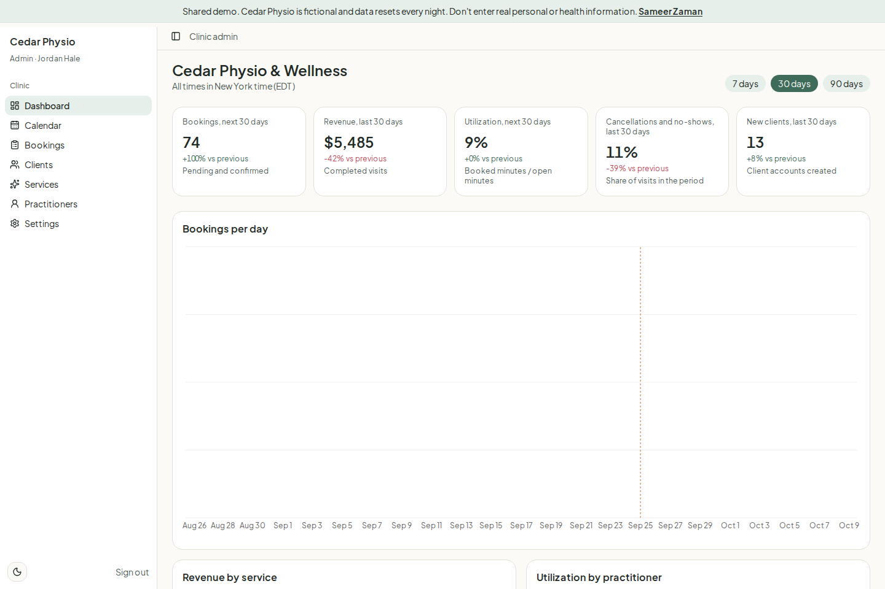
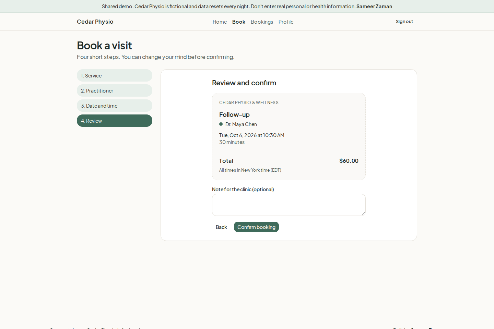
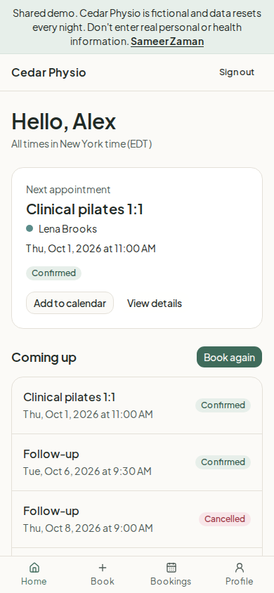
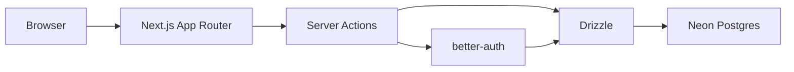
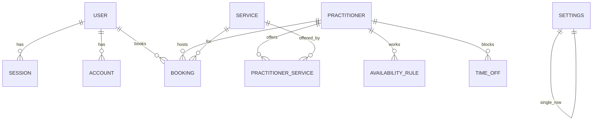

# Bookwell: booking and client portal MVP (concept demo)

Online booking and a client portal for small clinics and studios, with an admin dashboard for the owner. This demo runs as Cedar Physio & Wellness.

**Portfolio concept project by Sameer Zaman. Cedar Physio & Wellness is fictional; all data is generated.**

**Live demo:** [LIVE_DEMO_URL](LIVE_DEMO_URL)

Use the Try demo as admin / Try demo as client buttons. Data resets nightly.

<!-- TODO: replace after deploy -->







Refresh the images with `pnpm screenshots` while the app is running at `http://127.0.0.1:3000`.

## Features by role

**Client**

- Sign up or sign in, then book in four steps: service, practitioner (or Any available), date and time, review.
- See the next appointment, download an `.ics` file, and review upcoming and past visits.
- Reschedule or cancel outside the cancellation window.
- Update name and phone. Demo accounts cannot change email or password.

**Admin**

- Dashboard with five KPIs, deltas, and charts. Switch 7, 30, or 90 days from the URL.
- Week calendar per practitioner. Open a booking or start one from an empty slot.
- Bookings table with search, filters, sort, pagination, optimistic status changes, and bulk completed or no-show. Cards replace the table under 640px.
- Create and edit bookings, including internal notes.
- Manage clients, services, practitioners, weekly hours, and time off.
- Clinic settings and a Reset demo data now button (once every 5 minutes).

## Architecture





## Double-booking

The availability function lists only times that fit clinic hours, buffers, lead time, the booking window, and existing holds. The server runs that check again before every create or reschedule. Postgres then rejects a second pending or confirmed overlap for the same practitioner with a `btree_gist` exclusion constraint, and the app tells the visitor: "That time was just booked. Please pick another slot."

## Tech stack

Next.js App Router and Server Actions, React 19, TypeScript, Tailwind CSS v4, shadcn/ui, better-auth with the Drizzle adapter, Drizzle ORM, Neon Postgres (`@neondatabase/serverless` on Neon, `pg` for local Postgres), zod, react-hook-form, TanStack Table, Recharts, date-fns and date-fns-tz, Vitest, and Playwright. pnpm. Node 24 on Vercel.

## Free services used

| Service | Why | Plan |
|---|---|---|
| GitHub | Repo | Free |
| Vercel | Hosting, preview deploys, one daily cron job for the demo reset | Hobby (free, fine for a non-commercial portfolio demo) |
| Neon | Serverless Postgres (easiest via the Vercel Marketplace, which injects `DATABASE_URL` automatically) | Free plan |
| Nothing else is required | Email is not needed (no verification or reset emails in the demo). Optional later: Resend free tier for booking confirmation emails | |

## Local setup

1. Start Postgres 16:

```bash
docker compose up -d
```

2. Copy the env file and fill in secrets (`openssl rand -base64 32` for `BETTER_AUTH_SECRET`):

```bash
cp .env.example .env
```

3. Install, migrate, and seed:

```bash
pnpm install
pnpm db:setup
pnpm dev
```

Open http://localhost:3000. `pnpm db:setup` runs migrations (including the overlap constraint) and then the seed. Run it again any time; the seed truncates and recreates the same shape of data relative to today.

If you already have Postgres, point `DATABASE_URL` and `DATABASE_URL_UNPOOLED` at it. Migrations use the unpooled URL when it is set. Hosts that contain `neon.tech` use the Neon driver. Any other host uses node-postgres, so local Postgres and CI work the same way.

## Deploy

1. Import this repo into Vercel.
2. Add Neon from the Vercel Marketplace (Storage tab). That sets `DATABASE_URL` and `DATABASE_URL_UNPOOLED`.
3. Set the remaining env vars from the table below. Use the production URL for `BETTER_AUTH_URL` and `NEXT_PUBLIC_APP_URL`.
4. Run `pnpm db:setup` once against Neon, using `DATABASE_URL_UNPOOLED` (the setup script prefers that URL for migrations).
5. Redeploy.
6. Confirm the cron is listed. `vercel.json` calls `/api/cron/reset-demo` once a day. Vercel sends `Authorization: Bearer $CRON_SECRET`.

Do not enter real personal or health information. This is a shared demo and the database is reset every night.

## Env vars

| Name | Required | Example | Notes |
|---|---|---|---|
| `DATABASE_URL` | Yes | `postgresql://...neon.tech/neondb?sslmode=require` | Pooled Neon URL. Set automatically by the Vercel Neon integration |
| `DATABASE_URL_UNPOOLED` | Recommended | `postgresql://...` | Direct URL for migrations. Also set by the integration |
| `BETTER_AUTH_SECRET` | Yes | 32+ random chars | `openssl rand -base64 32` |
| `BETTER_AUTH_URL` | Yes | `https://bookwell-demo.vercel.app` | `http://localhost:3000` in dev |
| `NEXT_PUBLIC_APP_URL` | Yes | same as above | Links and metadata |
| `DEMO_ADMIN_EMAIL` | Yes | `admin@demo.bookwell.app` | Seeded demo admin |
| `DEMO_ADMIN_PASSWORD` | Yes | random | Server-side only |
| `DEMO_CLIENT_EMAIL` | Yes | `client@demo.bookwell.app` | Seeded demo client |
| `DEMO_CLIENT_PASSWORD` | Yes | random | Server-side only |
| `CRON_SECRET` | Yes | random | Protects `/api/cron/reset-demo` |
| `BUSINESS_TIMEZONE` | No | `America/New_York` | Default for the settings row |
| `DEMO_MODE` | No | `true` | Shows the reset control. The demo banner is always on |

## Testing

```bash
pnpm test
pnpm test:db
pnpm test:e2e
pnpm lint
pnpm typecheck
pnpm build
```

`pnpm test` covers the availability engine and auth helpers and does not need a database. `pnpm test:db` needs Postgres and checks the seed, signup role, the overlap constraint, the cancellation window, and the cron secret. `pnpm test:e2e` signs in as both demo roles, checks the dashboard, and books, reschedules, and cancels a visit. `pnpm build` does not query the database.

GitHub Actions runs typecheck, lint, unit tests, `pnpm db:setup`, database tests, and Playwright against a Postgres 16 service container.

## Project structure

```
app/            routes for the public site, portal, admin, and API
components/     UI, booking wizard, admin screens
db/             Drizzle schema and seed
drizzle/        SQL migrations, including the exclusion constraint
lib/            auth, availability, booking rules, actions
e2e/            Playwright smoke tests
scripts/        migrate, setup, screenshots
```

Built by [Sameer Zaman](https://sameer-zaman.vercel.app), available for MVP and full-stack work.
